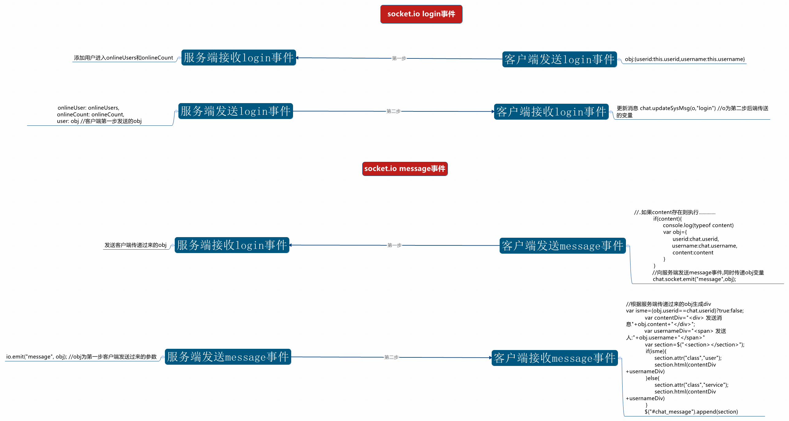

#思维导图



#服务端分析

###引入相关模块
```
//引入express同时实例化
var app=require("express")();
//创建http服务器
var http=require("http").Server(app);
//引入socket.io同时加载http服务器
var io=require("socket.io")(http)
```

###监听socket新用户加入事件
```
//监听新用户加入
	socket.on("login", function(obj) {
		//这里的obj是个很重要的东东.后面再来看
		//接受前端传来的 obj
		//格式为 {userid:this.id,username:this.username}
		socket.name = obj.userid
			//如果onlineUsers不存在当前用户
		if (!onlineUsers.hasOwnProperty(obj.userid)) {
			//onlineUsers.obj.userid=obj.username
			//以用户id作为索引添加用户名
			onlineUsers[obj.userid] = obj.username
			onlineCount++
		}

		//广播用户加入
		//这里的obj指的是前端传来的obj
		io.emit("login", {
			onlineUser: onlineUsers,
			onlineCount: onlineCount,
			user: obj
		})
		console.log(obj.username + "加入了聊天室")
	})
```


###监听socket用户退出(未完成)
前端和后端方式都是一样的,这里不进行修复了~留给大家思考


###监听socket用户发送消息
```
socket.on("message", function(obj) {
		//向所有客户端发送消息

		/*obj为客户端传递过来的参数
		 * 
		 * 
		 * obj{
		 * userid:chat.userid,
			username:chat.username,
			content:content	
		 * 
		 * }*/
		io.emit("message", obj);
		console.log(obj.username + "说:" + obj.content)
	})
```


#客户端分析

###客户端发送login广播给服务端
```
this.socket.emit("login",{userid:this.userid,username:this.username}) //56行
```

###客户端监听服务端发来的login广播
```
//监听服务端发来的login广播 
	this.socket.on("login",function(o){
		//这里o指向的是后端传入进来的变量
		chat.updateSysMsg(o,"login")
	})
```


###客户端发送message广播给服务端
```
var content=$("#chat_info").val()
		//..如果content存在则执行.............
		if(content){
			//这句没执行..如果content不为空..定义var...
			console.log(typeof content)
			var obj={
				userid:chat.userid,
				username:chat.username,
				content:content
			}
		}
		//向服务端发送message事件,同时传递obj变量
		chat.socket.emit("message",obj);
		return false;
```

###客户端监听到服务端发送的message广播
```
this.socket.on("message",function(obj){
		//判断是服务端传来的消息还是客户端发送的消息
		/*
		 * obj{
		 * 		userid:chat.userid,
				username:chat.username,
				content:content
		 * }
		 * */
		var isme=(obj.userid==chat.userid)?true:false;
		var contentDiv="<div> 发送消息"+obj.content+"</div>";
		var usernameDiv="<span> 发送人:"+obj.username+"</span>"
		var section=$("<section></section>");
		if(isme){
			section.attr("class","user");
			section.html(contentDiv+usernameDiv)
		}else{
			section.attr("class","service");
			section.html(contentDiv+usernameDiv)
		}
		$("#chat_message").append(section)
	})跟
```

###客户端监听到服务端发来的logout/服务端监听到客户端发来的logout.. (未完成 留给大家开发吧)


